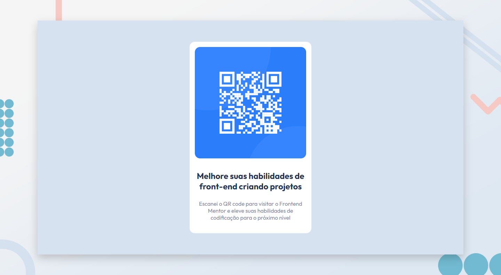

# Frontend  Mentor - Desafio QR Code

Esta é minha solução ao desafio **QR code component** do [Frontend Mentor](https://www.frontendmentor.io/). Meu objetivo foi de reproduzir o desafio de forma responsiva, usando o conceito mobile first.

Por [aqui](https://randyrobson.github.io/frontend-mentor-qr-code) você pode acessar o desafio.

 